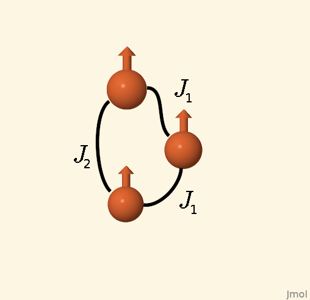
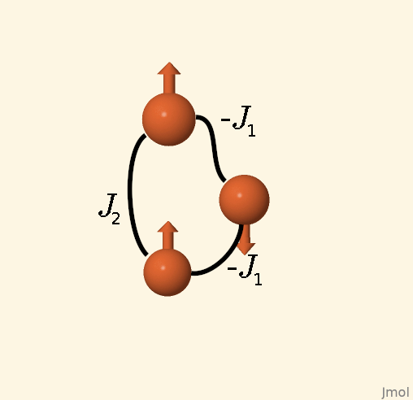

<p align="center"></p>
<p>JorGπ (<em>Georgie Pie</em>) is an automatic scheme of mapping an ab-initio system (so far using VASP) onto the Heisenberg model.</p>

# Workflow
1. Find a ground state of your magnetic structure.
1. Run ```JorGpi-startup```
    * You can check the options using ```JorGpi-startup --help```.
    * We suggest that for complicated structures you **do not** use the minimal-set mode.
    * Note that ```ICHARG=1``` will be added to all generated INCARS.
1. Run the calculations using your version of VASP.
    1. We recommend running the noFlip cell (enlarged cell provided in the previous step) and save the resultant CHGCAR file.
    1. Next use our tool ```JorGpi-demagnetize``` to extract the non-magnetic part of CHGCAR.
    1. Copy the file obtained above to the directories with the flipped states. With ICHARG=1 and no magnetic terms in CHGCAR VASP will use the charge-density with magnetic moments obtained from MAGMOM line.
    * The above is **not** necessary , yet it seems to speed-up the convergence.
    * It is also recommended to save your CHGCAR files as the excited magnetic states (*flipped*) might take significantly more electronic steps to converge.
1. Run ```JorGpi-pickup```
    * You can check the options using ```JorGpi-pickup --help```.
    * We suggest to check the *flipped* states for convergence.
    * The solver either solves the system of equations (if a minimal set of excided states is provided) or finds an optimal fit to the model using the least-squares method (thus canceling out the numerical error).

<p align="center"></p>
<p align="center"></p>
<h3 align="center">General Scheme of JorG workflow</h3>
<p align="center"></p>

# Options
## ```JorGpi-startup```
```bash
 JorGpi-startup --help
usage: JorGpi-startup [-h] [--input INPUT] [--incar INCAR] [--output OUTPUT]
                      [--cutOff CUTOFF | --neighbor NEIGHBOR] [--Wyckoffs WYCKOFFS]
                      [--reference REFERENCE] [--elements ELEMENTS]
                      [--group {1,2,3,4,5,6,7,8,9,10,11,12,13,14,15,16,17,18} [{1,2,3,4,5,6,7,8,9,10,11,12,13,14,15,16,17,18} ...]]
                      [--period {2p,3p,4p,5p,6p,3d,4d,5d,4f,5f} [{2p,3p,4p,5p,6p,3d,4d,5d,4f,5f} ...]]
                      [--block {P,D,F} [{P,D,F} ...]] [--minimal-set] [--buffer-cases BUFFER_CASES]
                      [--extra-dimentions EXTRA-DIMENTIONS] [--carthesian-output] [--symmetry]
                      [--refined]

Find minimal number of unique spin-flips

optional arguments:
  -h, --help            show this help message and exit
  --input INPUT, -i INPUT
                        input POSCAR file
  --incar INCAR, --INCAR INCAR, -I INCAR
                        input INCAR file
  --output OUTPUT, -o OUTPUT
                        output directory
  --cutOff CUTOFF, -R CUTOFF
                        a cut-off distance (in Å) for calculations
  --neighbor NEIGHBOR, -N NEIGHBOR
                        a rank of the last Neighbor taken into account
  --Wyckoffs WYCKOFFS, -W WYCKOFFS
                        narrows down the atomic selection to the atoms in positions defined by string
                        (eg. 'abc')
  --reference REFERENCE, -r REFERENCE
                        number of reference atom in inputFile
  --elements ELEMENTS, -E ELEMENTS
                        string of all elements taken into account (eg. 'CuO')
  --group {1,2,3,4,5,6,7,8,9,10,11,12,13,14,15,16,17,18} [{1,2,3,4,5,6,7,8,9,10,11,12,13,14,15,16,17,18} ...]
                        group number (eg. 1 <=> 'HLiNaKRbCsFr')
  --period {2p,3p,4p,5p,6p,3d,4d,5d,4f,5f} [{2p,3p,4p,5p,6p,3d,4d,5d,4f,5f} ...]
                        period name (eg. 3d <=> '$Sc$Ti$V$Cr$Mn$Fe$Co$Ni$Cu$Zn$')
  --block {P,D,F} [{P,D,F} ...]
                        block name (eg. P <=>
                        '$B$C$N$O$F$Al$Si$P$S$Cl$Ga$Ge$As$Se$Br$In$Sn$Sb$Te$I$Tl$Pb$Bi$Po$At$')
  --minimal-set         creates a minimal-set system of equations for final calculation of the
                        Heisenberg exchange interaction (default False)
  --buffer-cases BUFFER_CASES, -B BUFFER_CASES
                        The number of additional solutions of the Ising model (above the twice the
                        number of exchange interacions, (i.e., the ASA solver finds 2*J+B excited
                        states (default 4)
  --extra-dimentions EXTRA-DIMENTIONS, -X EXTRA-DIMENTIONS
                        string "X Y Z" of extra cell copies in each directions (eg. "0 0 1")
  --carthesian-output   Sets output cells to carthesian coordinates (default False, i.e., using direct
  --symmetry, -S        symmetry run only (default False)
  --refined             should use refined supercell (default False)
```

## ```JorGpi-pickup```
```bash
usage: JorGpi-pickup [-h] [--number-of-interactions #J] --reference dir
                     [--units {eV,meV,Ry,mRy,He,mHe,K}] --elements symbol [symbol ...] --directories
                     dir [dir ...]

Finding Js

optional arguments:
  -h, --help            show this help message and exit
  --number-of-interactions #J, -J #J
                        number of exchange-interaction magnitudes to-be-included in calculations
  --reference dir, --noFlip dir, -R dir
                        reference directory (usually noFlip/)
  --units {eV,meV,Ry,mRy,He,mHe,K}, -U {eV,meV,Ry,mRy,He,mHe,K}
                        units of energy
  --elements symbol [symbol ...], --atoms symbol [symbol ...], -E symbol [symbol ...]
                        Symbol of elements taken into account in calculations
  --directories dir [dir ...], -D dir [dir ...]
                        Directories containing flipped configurations (eg. flip00000/)
```

# Additional utilities
## ```JorGpi-demagnetize```
An ```awk```-based tool for removing the information on the magnetization from the CHGCAR. **Redirect standart output** if you want to save the result (```JorGpi-demagnetize > newCHGCAR``` or ```JorGpi-demagnetize PATH_TO_CHAGCAR > newCHGCAR```)!

## ```JorGpi-KPOINTS```
A tool usefull for the non-diagonal cells -> provides with the propositions on the reciprocal space mesh. Use ```JorGpi-KPOINTS POSCAR1 POSCAR2 ...```

## ```JorGpi-POSCAR```
A POSCAR unit converter
### Options
```bash
usage: JorGpi-POSCAR [-h] [--convert-to {d,c,k,D,C,K,Direct,Carthesian}] --files POSCAR_file
                     [POSCAR_file ...]

Converting POSCAR files

optional arguments:
  -h, --help            show this help message and exit
  --convert-to {d,c,k,D,C,K,Direct,Carthesian}, -T {d,c,k,D,C,K,Direct,Carthesian}
                        Convertion To
  --files POSCAR_file [POSCAR_file ...], -F POSCAR_file [POSCAR_file ...]
                        POSCAR files to convert
```

# Exemplary flips
<p align="center"></p>
<p>by A.P. Kądzielawa using Jmol: an open-source Java viewer for chemical structures in 3D. <a url="http://www.jmol.org/"</a>www.jmol.org</p>

<a href="https://codebeat.co/projects/github-com-mellechowicz-jorg-experimental"></a>
<a href="https://www.codefactor.io/repository/github/mellechowicz/jorg"></a>


<a href="https://www.codacy.com/manual/apkadzielawa/JorG?utm_source=github.com&amp;utm_medium=referral&amp;utm_content=Mellechowicz/JorG&amp;utm_campaign=Badge_Grade"></a>
<a href="https://www.codacy.com/manual/apkadzielawa/JorG?utm_source=github.com&amp;utm_medium=referral&amp;utm_content=Mellechowicz/JorG&amp;utm_campaign=Badge_Coverage"></a>
<a href="https://doi.org/10.5281/zenodo.3944649"></a>

<sub><sup>This work was supported by The Ministry of Education, Youth and Sports from the Large Infrastructures for Research, Experimental Development and Innovations project *IT4Innovations National Supercomputing Center – LM2015070*.</sup></sub>
